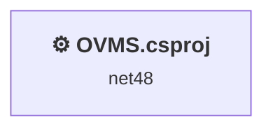
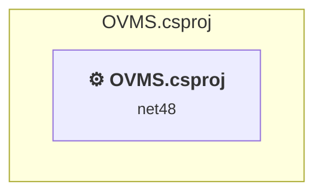

# Projects and dependencies analysis

This document provides a comprehensive overview of the projects and their dependencies in the context of upgrading to .NETCoreApp,Version=v10.0.

## Table of Contents

- [Executive Summary](#executive-Summary)
  - [Highlevel Metrics](#highlevel-metrics)
  - [Projects Compatibility](#projects-compatibility)
  - [Package Compatibility](#package-compatibility)
  - [API Compatibility](#api-compatibility)
- [Aggregate NuGet packages details](#aggregate-nuget-packages-details)
- [Top API Migration Challenges](#top-api-migration-challenges)
  - [Technologies and Features](#technologies-and-features)
  - [Most Frequent API Issues](#most-frequent-api-issues)
- [Projects Relationship Graph](#projects-relationship-graph)
- [Project Details](#project-details)

  - [OVMS.csproj](#ovmscsproj)

## Executive Summary

### Highlevel Metrics

| Metric | Count | Status |
| :--- | :---: | :--- |
| Total Projects | 1 | All require upgrade |
| Total NuGet Packages | 14 | 5 need upgrade |
| Total Code Files | 13 |  |
| Total Code Files with Incidents | 3 |  |
| Total Lines of Code | 3415 |  |
| Total Number of Issues | 33 |  |
| Estimated LOC to modify | 22+ | at least 0,6% of codebase |

### Projects Compatibility

| Project | Target Framework | Difficulty | Package Issues | API Issues | Est. LOC Impact | Description |
| :--- | :---: | :---: | :---: | :---: | :---: | :--- |
| [OVMS.csproj](#ovmscsproj) | net48 | 🟢 Low | 9 | 22 | 22+ | ClassicDotNetApp, Sdk Style = False |

### Package Compatibility

| Status | Count | Percentage |
| :--- | :---: | :---: |
| ✅ Compatible | 9 | 64,3% |
| ⚠️ Incompatible | 0 | 0,0% |
| 🔄 Upgrade Recommended | 5 | 35,7% |
| ***Total NuGet Packages*** | ***14*** | ***100%*** |

### API Compatibility

| Category | Count | Impact |
| :--- | :---: | :--- |
| 🔴 Binary Incompatible | 0 | High - Require code changes |
| 🟡 Source Incompatible | 13 | Medium - Needs re-compilation and potential conflicting API error fixing |
| 🔵 Behavioral change | 9 | Low - Behavioral changes that may require testing at runtime |
| ✅ Compatible | 2590 |  |
| ***Total APIs Analyzed*** | ***2612*** |  |

## Aggregate NuGet packages details

| Package | Current Version | Suggested Version | Projects | Description |
| :--- | :---: | :---: | :--- | :--- |
| BouncyCastle | 1.8.5 | 1.8.9 | [OVMS.csproj](#ovmscsproj) | Das NuGet-Paket enthält Sicherheitsrisiken |
| Exceptionless | 4.6.2 |  | [OVMS.csproj](#ovmscsproj) | ✅Compatible |
| Google.Protobuf | 3.14.0 |  | [OVMS.csproj](#ovmscsproj) | ✅Compatible |
| K4os.Compression.LZ4 | 1.2.6 |  | [OVMS.csproj](#ovmscsproj) | ✅Compatible |
| K4os.Compression.LZ4.Streams | 1.2.6 |  | [OVMS.csproj](#ovmscsproj) | ✅Compatible |
| K4os.Hash.xxHash | 1.0.6 |  | [OVMS.csproj](#ovmscsproj) | ✅Compatible |
| MySql.Data | 8.0.28 |  | [OVMS.csproj](#ovmscsproj) | ✅Compatible |
| Newtonsoft.Json | 13.0.1 | 13.0.4 | [OVMS.csproj](#ovmscsproj) | Ein NuGet-Paketupgrade wird empfohlen |
| System.Buffers | 4.5.1 |  | [OVMS.csproj](#ovmscsproj) | Die Funktionalität des NuGet-Pakets ist im Frameworkverweis enthalten |
| System.Collections.Immutable | 1.7.1 | 10.0.3 | [OVMS.csproj](#ovmscsproj) | Ein NuGet-Paketupgrade wird empfohlen |
| System.Memory | 4.5.4 |  | [OVMS.csproj](#ovmscsproj) | Die Funktionalität des NuGet-Pakets ist im Frameworkverweis enthalten |
| System.Reflection.Metadata | 1.8.1 | 10.0.3 | [OVMS.csproj](#ovmscsproj) | Ein NuGet-Paketupgrade wird empfohlen |
| System.Runtime.CompilerServices.Unsafe | 5.0.0 | 6.1.2 | [OVMS.csproj](#ovmscsproj) | Ein NuGet-Paketupgrade wird empfohlen |
| System.Threading.Tasks.Extensions | 4.5.4 |  | [OVMS.csproj](#ovmscsproj) | Die Funktionalität des NuGet-Pakets ist im Frameworkverweis enthalten |

## Top API Migration Challenges

### Technologies and Features

| Technology | Issues | Percentage | Migration Path |
| :--- | :---: | :---: | :--- |
| Legacy Configuration System | 5 | 22,7% | Legacy XML-based configuration system (app.config/web.config) that has been replaced by a more flexible configuration model in .NET Core. The old system was rigid and XML-based. Migrate to Microsoft.Extensions.Configuration with JSON/environment variables; use System.Configuration.ConfigurationManager NuGet package as interim bridge if needed. |

### Most Frequent API Issues

| API | Count | Percentage | Category |
| :--- | :---: | :---: | :--- |
| T:System.Net.Http.HttpContent | 4 | 18,2% | Behavioral Change |
| T:System.Net.ServicePointManager | 4 | 18,2% | Source Incompatible |
| T:System.Uri | 3 | 13,6% | Behavioral Change |
| P:System.Configuration.ApplicationSettingsBase.Item(System.String) | 3 | 13,6% | Source Incompatible |
| M:System.Uri.#ctor(System.String) | 2 | 9,1% | Behavioral Change |
| F:System.Net.SecurityProtocolType.Ssl3 | 2 | 9,1% | Source Incompatible |
| M:System.Net.WebClient.#ctor | 1 | 4,5% | Source Incompatible |
| M:System.TimeSpan.FromSeconds(System.Double) | 1 | 4,5% | Source Incompatible |
| M:System.Configuration.ApplicationSettingsBase.#ctor | 1 | 4,5% | Source Incompatible |
| T:System.Configuration.ApplicationSettingsBase | 1 | 4,5% | Source Incompatible |

## Projects Relationship Graph

Legend:
📦 SDK-style project
⚙️ Classic project

## Project Details

### OVMS.csproj

#### Project Info

- **Current Target Framework:** net48
- **Proposed Target Framework:** net10.0
- **SDK-style**: False
- **Project Kind:** ClassicDotNetApp
- **Dependencies**: 0
- **Dependants**: 0
- **Number of Files**: 13
- **Number of Files with Incidents**: 3
- **Lines of Code**: 3415
- **Estimated LOC to modify**: 22+ (at least 0,6% of the project)

#### Dependency Graph

Legend:
📦 SDK-style project
⚙️ Classic project

### API Compatibility

| Category | Count | Impact |
| :--- | :---: | :--- |
| 🔴 Binary Incompatible | 0 | High - Require code changes |
| 🟡 Source Incompatible | 13 | Medium - Needs re-compilation and potential conflicting API error fixing |
| 🔵 Behavioral change | 9 | Low - Behavioral changes that may require testing at runtime |
| ✅ Compatible | 2590 |  |
| ***Total APIs Analyzed*** | ***2612*** |  |

#### Project Technologies and Features

| Technology | Issues | Percentage | Migration Path |
| :--- | :---: | :---: | :--- |
| Legacy Configuration System | 5 | 22,7% | Legacy XML-based configuration system (app.config/web.config) that has been replaced by a more flexible configuration model in .NET Core. The old system was rigid and XML-based. Migrate to Microsoft.Extensions.Configuration with JSON/environment variables; use System.Configuration.ConfigurationManager NuGet package as interim bridge if needed. |

